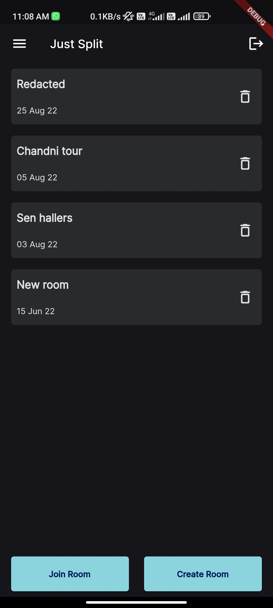
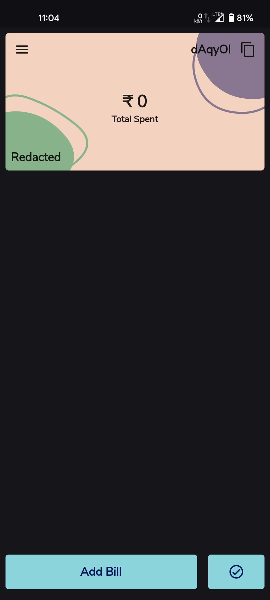
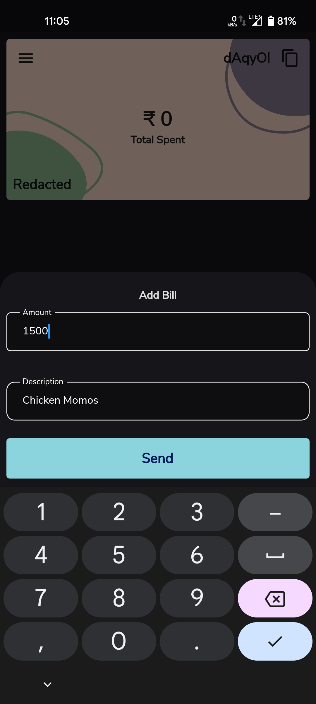
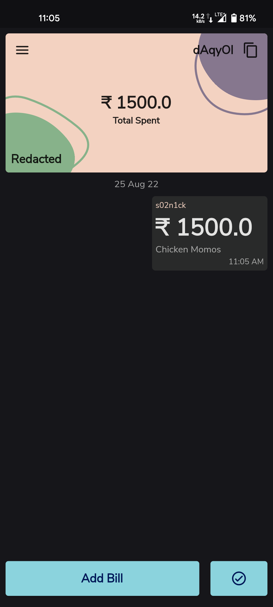
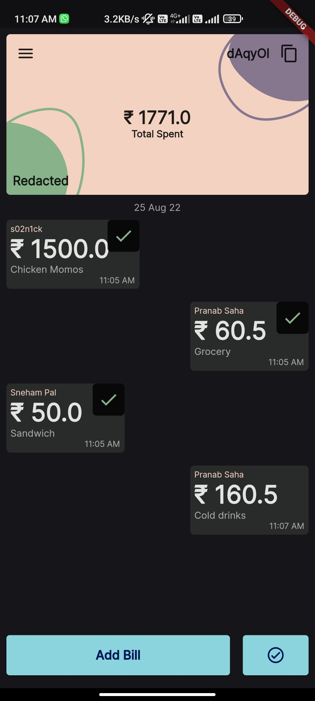
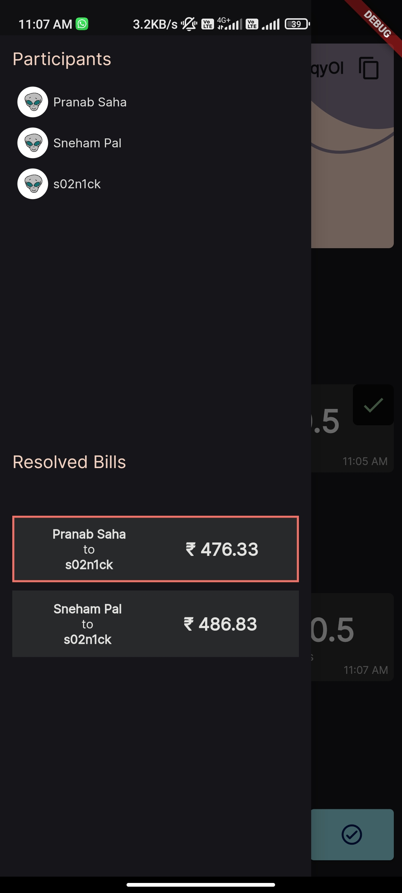
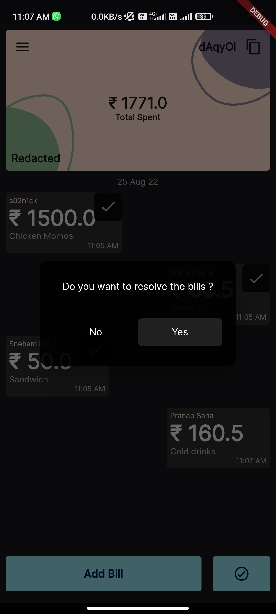
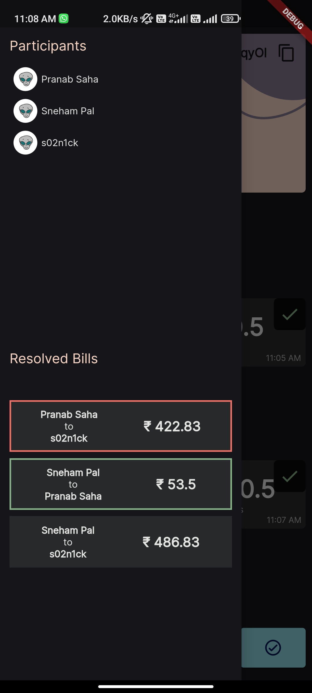

# Just_split

- A bill splitter app which splits the bill among a group with minimum required transactions.
- Users can create and join rooms, add bills in real-time in a room, split the bills on tap of a button.
- Implemented backtracking algorithm to find all possible transactions to split the bill and return the one with **minimum transactions** needed.
- Implemented MVVM pattern with proper state management with **Flutter BLOC** and **Firebase** as backend.
  
## Screenshots

  
  
  
  
  
  
  
  
  

## Getting Started

This project is a starting point for a Flutter application.

A few resources to get you started if this is your first Flutter project:

- [Lab: Write your first Flutter app](https://flutter.dev/docs/get-started/codelab)
- [Cookbook: Useful Flutter samples](https://flutter.dev/docs/cookbook)

For help getting started with Flutter, view our
[online documentation](https://flutter.dev/docs), which offers tutorials,
samples, guidance on mobile development, and a full API reference.
